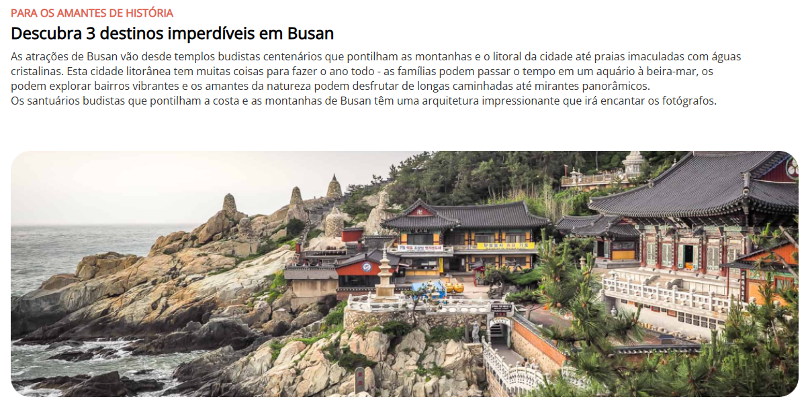

<h1 align="center"> Local Turistico </h1>

  Primeiro projeto desenvolvido com os conhecimentos adquiridos no primeiro módulo do curso da Rocketseat. 
  <strong>O objetivo deste projeto é trabalhar os conceitos de HTML e CSS.</strong>

  <a href="#-tecnologias">Tecnologias</a>&nbsp;&nbsp;&nbsp;|&nbsp;&nbsp;&nbsp;
  <a href="#-projeto">Projeto</a>&nbsp;&nbsp;&nbsp;

 

  
  

## 🚀 Tecnologias

Esse projeto foi desenvolvido com as seguintes tecnologias:

- HTML e CSS
- Git e Github
- Figma

## 💻 Projeto

Esta página traz informações de uma viagem para Busan na Coreia do Sul.

---

Feito com ♥ by May
